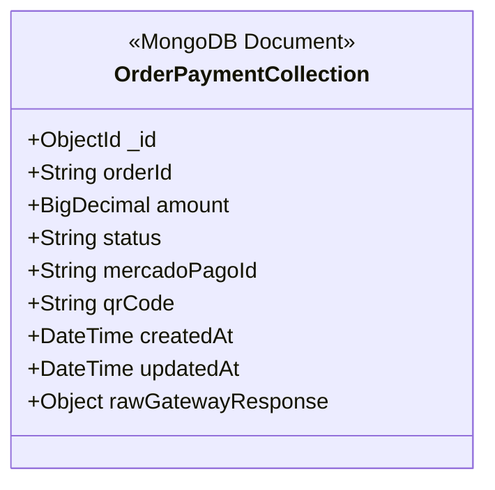

# Payment Service - FIAP Tech Challenge

Este microsserviço é o módulo responsável pelo processamento de pagamentos. Ele integra com o **Mercado Pago**, gerencia o status das transações e comunica as atualizações para o sistema de pedidos via mensageria assíncrona.


---

##  Arquitetura e Fluxo

O serviço segue uma arquitetura orientada a eventos para garantir desacoplamento e resiliência:

1.  **Recepção do Webhook:** O Mercado Pago notifica este serviço sobre mudanças no status do pagamento.
2.  **Validação:** O serviço consulta a API do Mercado Pago para confirmar a autenticidade e status atual da transação.
3.  **Persistência:** O status atualizado é salvo no **MongoDB**.
4.  **Notificação:** O serviço publica o novo status em um tópico **AWS SNS** (ou fila **SQS**), permitindo que o *Order Service* prossiga com a produção do pedido.

##  Tech Stack

* **Linguagem:** Kotlin (JVM 21)
* **Framework:** Spring Boot 3
* **Gerenciador de Dependências:** Gradle (Kotlin DSL)
* **Banco de Dados:** MongoDB
* **Cloud & Mensageria:** AWS SQS, SNS e Parameter Store (SSM)
* **Pagamentos:** Mercado Pago API
* **Infraestrutura as Code:** Terraform
* **Qualidade:** SonarQube & JaCoCo

## Pré-requisitos

* JDK 21 instalado
* Docker e Docker Compose
* Credenciais da AWS configuradas (para acesso ao Parameter Store e filas)
* Token de acesso do Mercado Pago (Sandbox)


## Modelagem de Dados (NoSQL)

Utilizamos o **MongoDB** devido à flexibilidade de schema necessária para armazenar os payloads de retorno dos gateways de pagamento, que podem variar.

Abaixo está a representação da estrutura do documento na coleção `payments`. Embora seja *schemaless*, a aplicação espera a seguinte estrutura:


Exemplo de documento JSON:

```JSON
{
  "_id": {
    "$oid": "6960166dfc44ff0c027db33c"
  },
  "orderId": "order-001",
  "amount": "0.01",
  "status": "processed",
  "mercadoPagoId": "ORDTST01KEFNF82RM5BBZFVZR7A7VNJY",
  "qrCode": "",
  "createdAt": {
    "$date": "2026-01-08T20:41:17.690Z"
  },
  "updatedAt": {
    "$date": "2026-01-08T20:42:20.312Z"
  },
  "_class": "br.com.fiap.techchallenge.paymentservice.domain.OrderPayment"
}
```

##  Configuração e Execução

### Variáveis de Ambiente
O projeto busca configurações sensíveis no **AWS Systems Manager (Parameter Store)**. Certifique-se de que sua aplicação tenha permissão para ler ou defina overrides locais no `application.yml` para testes.

### Executando Localmente (Gradle)
```bash
# Setar a aws profile, se necessário
export AWS_PROFILE=<seu-perfil-aws>

# Aplicar mudanças do terraform (se aplicável)
cd infra/terraform
terraform init
terraform plan
terraform apply

# Baixar dependências e compilar
./gradlew clean build

# Rodar a aplicação
./gradlew bootRun
```
O serviço estará disponível em `http://localhost:8080`.

### Executando com Docker
```bash
docker-compose up -d --build
```

### Testes e Qualidade de Código
O projeto possui uma forte cobertura de testes unitários e integração com SonarQube para análise estática.

#### Rodar Testes Unitários
```bash
./gradlew test
```

#### Gerar Relatório de Cobertura (JaCoCo)
Os relatórios serão gerados em build/reports/jacoco/test/html/index.html.
```bash
./gradlew jacocoTestReport
```

#### Análise SonarQube Local
Certifique-se de ter um servidor SonarQube rodando ou token do SonarCloud.

```bash
./gradlew sonar \
-Dsonar.projectKey=Grupo-110-Fiap_payment-service \
-Dsonar.host.url=http://localhost:9000 \
-Dsonar.token=SEU_TOKEN
```

### API ENDPOINTS
#### `POST /api/payments`

Cria um novo pagamento para um pedido.

**Request Body:**

```json
{
  "orderId": 123,
  "amount": 100.00
}
```

**Response (201 Created):**

```json
{
  "id": "60d5f3f7e8b4a2a1b0e8b4a2",
  "orderId": 123,
  "amount": 100.00,
  "status": "created",
  "qrCode": "..."
}
```

### Webhooks

#### `POST /api/payments/webhook`

Recebe notificações de webhook do Mercado Pago.

**Request Body (Exemplo):**

```json
{
  "type": "order",
  "data": {
    "id": "123456789"
  }
}
```

<!-- Relative Markdown -->


